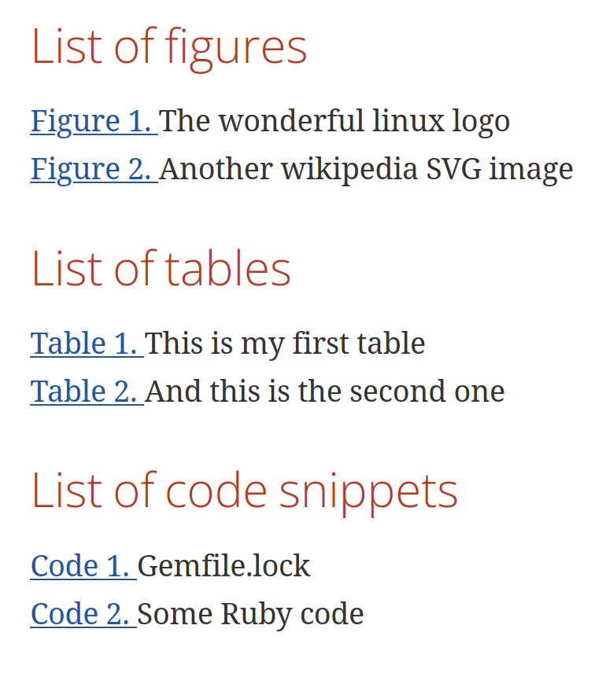

= asciidoctor-lists

image:https://github.com/Alwinator/asciidoctor-lists/actions/workflows/test.yml/badge.svg[Test, link=https://github.com/Alwinator/asciidoctor-lists/actions/workflows/test.yml]
image:https://github.com/Alwinator/asciidoctor-lists/actions/workflows/publish_gem.yml/badge.svg[Build, link=https://github.com/Alwinator/asciidoctor-lists/actions/workflows/publish_gem.yml]
image:https://img.shields.io/gem/v/asciidoctor-lists.svg[Latest Release, link=https://rubygems.org/gems/asciidoctor-lists]

An https://asciidoctor.org/[asciidoctor] extension that adds a list of figures, a list of tables, or a list of anything you want!

*Pull Request are always welcome! :)*

== Install
[source,asciidoc]
----
gem install asciidoctor-lists
----

== Sample
=== Code
[source,asciidoc]
----
...

.And this is the second one
|===
|Column 1, Header Row |Column 2, Header Row

|Cell in column 1, row 1
|Cell in column 2, row 1

|Cell in column 1, row 2
|Cell in column 2, row 2
|===

.Another wikipedia SVG image
image::https://upload.wikimedia.org/wikipedia/commons/thumb/4/4f/SVG_Logo.svg/400px-SVG_Logo.svg.png[SVG,100,100]

=== List of figures
element_list::[element=image]

=== List of tables
element_list::[element=table]

----

=== Rendered

== Docker
[source,bash]
----
# Build container
docker build -t asciidoctor-lists .
# Run Docker
docker run -it --rm -v $(pwd):/work asciidoctor-lists
# Build sample
asciidoctor-pdf -r asciidoctor-lists samples/list-sample.adoc
----

== Dev setup
=== Run
[source,bash]
----
asciidoctor -r ./lib/asciidoctor-lists.rb samples/list-sample.adoc
----

=== Install Gem
[source,bash]
----
gem build asciidoctor-lists.gemspec
gem install asciidoctor-lists-x.x.x.gem
----